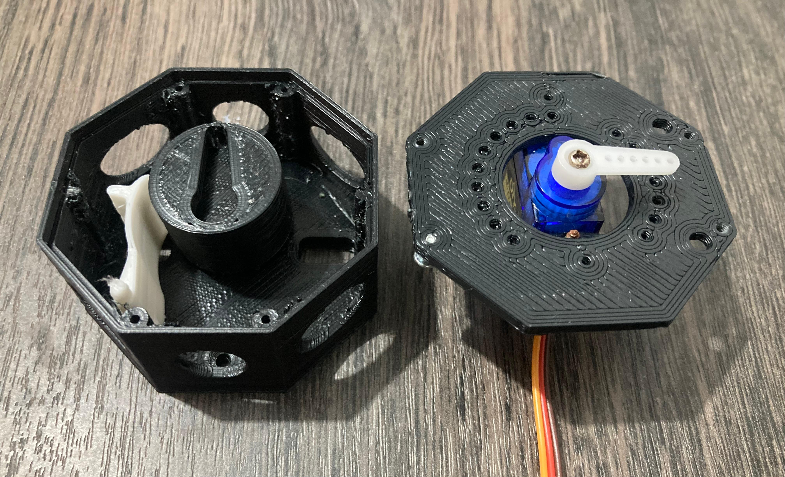

# Servo Valve (SG90) Control with Arduino Uno 🧑‍💻

# Proposal 🤓
With this code we seeks to connect and automate the Chem-Ecar 2025 with the goal of developing a more practical vehicle for the following year's competition 🚗.

# Note
This code is designed to work with Arduino Uno, a microcontroller board based on AVR technology.

# Arduino Uno's Input Pull-Up Resistors
To simplify the circuit, we've employed the built-in input pull-up resistors on Arduino Uno. By enabling the pull-up resistor on digital pin 2, we can detect voltage changes when the pin is grounded, eliminating the need for an external resistor.

# Arduino Uno's Interrupt 
Arduino Uno offers two pins specifically designed for interrupt handling: digital pins 2 and 3. These pins allow the microcontroller to react to external events without constantly polling the pins, improving efficiency and responsiveness.

For this project, we've utilized digital pin 2 to trigger an interrupt when the voltage level changes, enabling precise control of the servo valve.

# Design 🖥️
[The servo valve design is by red5alex and can be found on Printables](https://www.printables.com/model/207051-servo-valve) I used this design and it worked great.

